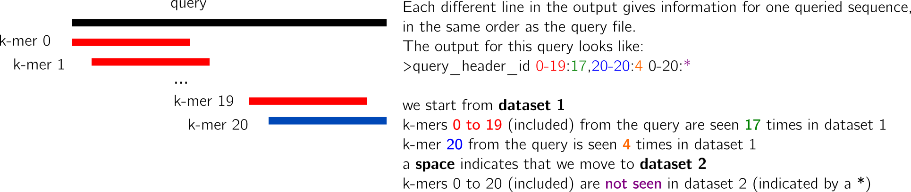

# REINDEER: efficient indexing of k-mer presence and abundance in sequencing datasets

   * [Motivation](#motivation)
   * [Installation](#installation)
      * [Requirements](#requirements)
      * [Quick start](#quick-start)
   * [Index construction](#index-construction)
      * [Starting with read files (raw or gzipped fasta/fastq)](#starting-with-read-files-raw-or-gzipped-fastafastq)
      * [Starting with De Bruijn graph files (raw or gzipped fasta files)](#starting-with-de-bruijn-graph-files-raw-or-gzipped-fasta-files)
   * [Query fasta files](#query-fasta-files)
   * [Index and query k-mers presence/absence only (not abundances)](#index-and-query-k-mers-presenceabsence-only-not-abundances)
   * [Output](#output)
      * [k-mer abundances](#k-mer-abundances)
   * [Beta options](#beta-options)
      * [query the index on the disk instead of loading the index in-ram](#query-the-index-on-the-disk-instead-of-loading-the-index-in-ram)
      * [log counts/quantized counts](#log-countsquantized-counts)
      * [input paired-end reads (to bcalm)](#input-paired-end-reads-to-bcalm)
   * [Reproduce the manuscript's results](#reproduce-the-manuscripts-results)
   * [Citation and resources](#citation-and-resources)
   * [Advanced FAQ](#advanced-faq)


# Motivation

REINDEER builds a data-structure that indexes k-mers and their abundances in a collection of datasets (raw RNA-seq or metagenomic reads for instance).
Then, a sequence (FASTA) can be queried for its presence and abundance in each indexed dataset.
While other tools (e.g. SBT, BIGSI) were also designed for large-scale k-mer presence/absence queries, retrieving abundances was so far unsupported (except for single datasets, e.g. using some k-mer counters like KMC, Jellyfish). REINDEER combines fast queries, small index size, and low memory footprint during indexing and queries. We showed it allows to index 2585 RNA-seq datasets (~4 billions k-mers) using less than 60GB of RAM and a final index size lower than 60GB on the disk.
Then, a REINDEER index can either be queried on disk (experimental feature, low RAM usage) or be loaded in RAM for faster queries.


Note on presence/absence queries: REINDEER supports this type of queries, although other data structures are more fit for this task. See for instance:

* [HowDeSBT](https://www.ncbi.nlm.nih.gov/pubmed/31504157)
* [Vari-Merge](https://academic.oup.com/bioinformatics/article/35/14/i51/5529124)
* [BIGSI](https://www.ncbi.nlm.nih.gov/pubmed/30718882)
* [BiFrost](https://www.biorxiv.org/content/10.1101/695338v2)

to name a few.

# Installation

## Requirements
* GCC >= 4.8
* CMAKE >  3.10.0

To install, first clone the project:

`git clone --recursive https://github.com/kamimrcht/REINDEER.git`

Then:

`cd REINDEER`

`sh install.sh`

or

`cd REINDEER`

`make`

Test can be run:

`make test`

### Compilation tips

If REINDEER gives a `Error: no such instruction` during compilation, try replacing `-march=native -mtune=native` by `-msse4` in the file `makefile`. If this did not work, please file an issue.

## Quick start
Have a look at the file of file format in `test/fof_unitigs.txt`. REINDEER assumes unitig files have been created using BCALM. You can provide a file of file of each unitig file (fasta) instead of the read files (-f) and an output directory for the index files (-o). By default, index files will be written in `reindeer_index_files_` + date + a tag.
Then build the index:

`./Reindeer --index -f test/fof_unitigs.txt -o quick_out`

and query: simply provide the fasta query file (**single line**) to Reindeer using `-q`, along with the directory of index files that were generated during index construction (-l), and a writeable path for the output (-o). Default output will be written in the `query_result` directory:


`./Reindeer --query -q test/query_test.fa -l quick_out -o quick_out/result_test.txt`

In this example, results should be in `quick_out/result_test.txt`.

Help:

`./Reindeer --help`


# Notes on last release (1.4.6)
Major
    - Default disk mode (index written on disk and disk queries)
    - Dependency on C++17
    - Various k-mer counting format (sum, average, normalized)
Minor
    - Change of index file names
    - Correction of various bugs
    - switched to object implementation
    - some modifications to pass the input/output files
    - implementation of code for socket mode [beta]


# Index and query k-mers presence/absence only (not abundances)

By default, REINDEER records k-mers abundances in each input dataset.
In order to have k-mer presence/absence instead of abundance per indexed dataset, use `--nocount` option.

`./Reindeer --index -f test/fof_unitigs.txt --nocount -o index_nocount`
`./Reindeer --query -l index_nocount -q test/query_test.fa --nocount`


## Output values format


When using output with counts, we have 4 kinds of counts:

|  Format name  |                       Count                      |
|:-------------:|:------------------------------------------------:|
| raw = default |                 k-mer abundances                 |
|      sum      |              sum of all k-mer counts             |
|  average/mean |          sum all k-mer / number of k-mer         |
|   normalize   | sum * 1.10^9 / total kmer in unitig file (bcalm) |

The last 3 formats are available since version 1.4.

These formats compute the sum of all k-mer in query sequence, so if length(query sequence) = k, you will
get sum = average.


### k-mer abundances (format raw)

Let's say that the query is 51 bases long and we look for 31-mers.
There are 21 k-mers in the query, from k-mer 0 to k-mer 20.
The output of REINDEER looks like:




Why can we observe different values for k-mers in a single query?  I answer this question in the [advanced FAQ](#advanced-faq).
i
# Beta options


## log counts/quantized counts

`./Reindeer --index --log-count -f fof_unitigs.txt`

`./Reindeer --index --quantization -f test/fof_unitigs.txt`


## input paired-end reads (to bcalm)


`./Reindeer --index --paired-end --bcalm  -f fof.txt`

# Reproduce the manuscript's results

We provide a page with scripts to reproduce the results we show in our manuscript, link [here](https://github.com/kamimrcht/REINDEER/tree/master/reproduce_manuscript_results).


# Citation and resources

REINDEER has been published in [Bioinformatics](https://academic.oup.com/bioinformatics/article/36/Supplement_1/i177/5870500?login=true). 
It was presented during ISMB conference in 2020. Main developper: Camille Marchet.

Access to the preprint: [REINDEER: efficient indexing of k-mer presence and abundance
in sequencing datasets](https://www.biorxiv.org/content/10.1101/2020.03.29.014159v1.full.pdf).

Presentation recorded during [BiATA 2020](https://www.youtube.com/watch?v=CbTaM5zX09U).

Citations:
```Bibtex
@inproceedings{marchet2020reindeer,
  title ={{REINDEER}: efficient indexing of k-mer presence and abundance in sequencing datasets},
 author={Marchet, Camille and Iqbal, Zamin and Gautheret, Daniel and Salson, Mika{\"e}l and Chikhi, Rayan},
  booktitle =        {28th Intelligent Systems for Molecular Biology (ISMB 2020)},
  year =         {2020},
  doi =         {10.1101/2020.03.29.014159},
}
@article{marchet2020reindeer,
  title={REINDEER: efficient indexing of k-mer presence and abundance in sequencing datasets},
  author={Marchet, Camille and Iqbal, Zamin and Gautheret, Daniel and Salson, Mika{\"e}l and Chikhi, Rayan},
  journal={Bioinformatics},
  volume={36},
  number={Supplement\_1},
  pages={i177--i185},
  year={2020},
  publisher={Oxford University Press}
}
```
# Advanced FAQ

## Why can we observe different values for k-mers in a single query


# Changelog

 * See [Changelog.md](changelog.md) file.

 * Major modification:

   - since version 1.4, we change the format of reindeer_matrix_eqc_info file.
     It is now a text file instead of a binary format. To convert the file, you
     can use the update_reindeer_info program to update the file for index
     build with previous version of Reindeer.  The normalisation format require
     the total number of k-mer in each unitig file (bcalm output).  For
     previous index build, 2 possibility:
     - You have access to the unitig files: If you give in argument the fof.txt
       file (-f option), listing the location of unitig file, the program will
       count the total k-mer in each unitig file and store them in the file.
     - You don't have the unitig files: convert the reindeer_matrix_eqc_info
       with the converter without -f option.
       - If you don't insert the total k-mer per sample in this file, it will
        be not possible to use the format 'normalization'.

